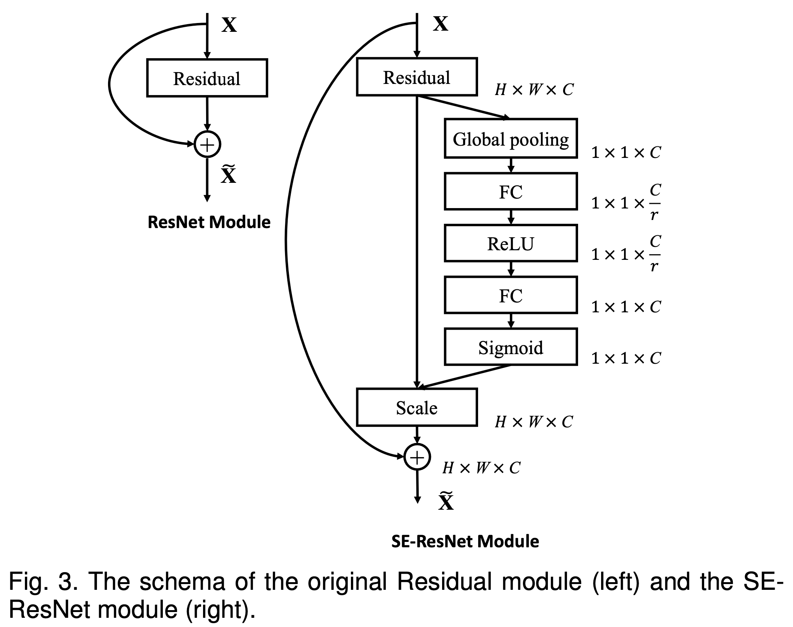
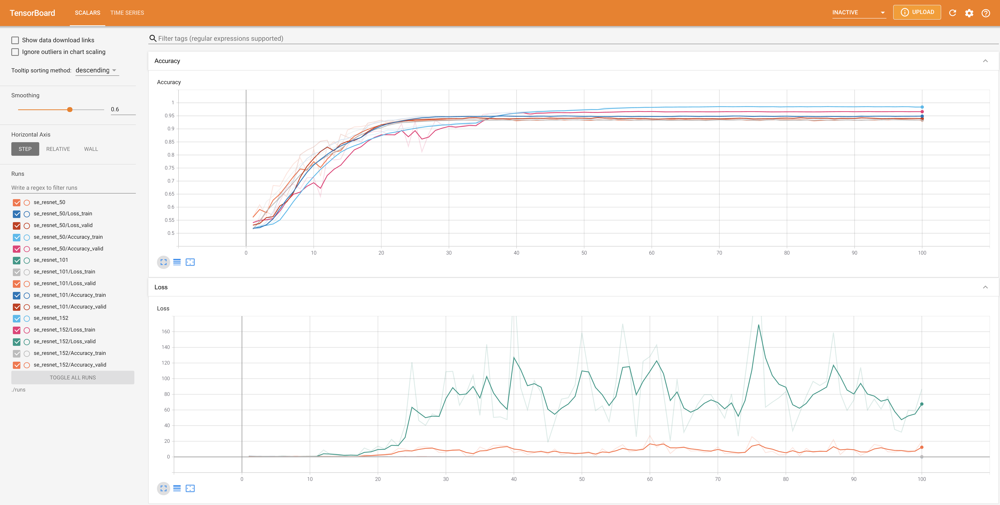

# Squeeze-and-Excitation Networks

Pytorch로 [SENet](https://arxiv.org/abs/1709.01507)을 구현한 코드입니다.

모델의 학습 및 검증에는 kaggle의 [Dogs vs. Cats dataset](https://www.kaggle.com/c/dogs-vs-cats/data)을 사용하였습니다.

구현한 네트워크 모듈은 다음과 같으며, 이를 통해 SE-ResNet-50, SE-ResNet-101, SE-ResNet-152를 구현하였습니다.



## Environments

- Google Colab Pro
- Python 3.7.10

## Requirements

실험한 Colab 환경의 패키지들은 다음과 같이 설치할 수 있습니다.

(Colab 환경에서 export한 패키지 목록이므로, 되도록이면 코랩 환경에서 진행하시기를 추천드립니다.)

```
pip install -r requirements.txt
```

## Results




## Quick Start

1. kaggle의 [Dogs vs. Cats dataset](https://www.kaggle.com/c/dogs-vs-cats/data)에서 `train.zip`를 내려받아 `data` 디렉토리에 다음과 같이 압축을 풉니다.
```
data/
    train/
        cat.0.jpg
        cat.10000.jpg
        cat.10001.jpg
        ...
        dog.0.jpg
        dog.10000.jpg
        dog.10001.jpg
        ...
```

2. SE-ResNet-50 모델은 다음과 같이 학습할 수 있습니다.

```
python train.py --data_dir data/ --save_dir experiments/ --num_layers 50 --epochs 100 --batch_size 32 --learning_rate 0.1
```

학습된 모델은 `experiments/`에 저장되고, tensorboard events는 `runs/`에 저장됩니다.

3. tensorboard를 통해 accuracy와 loss의 curve를 확인할 수 있습니다.

```
tensorboard --logdir=runs/
```