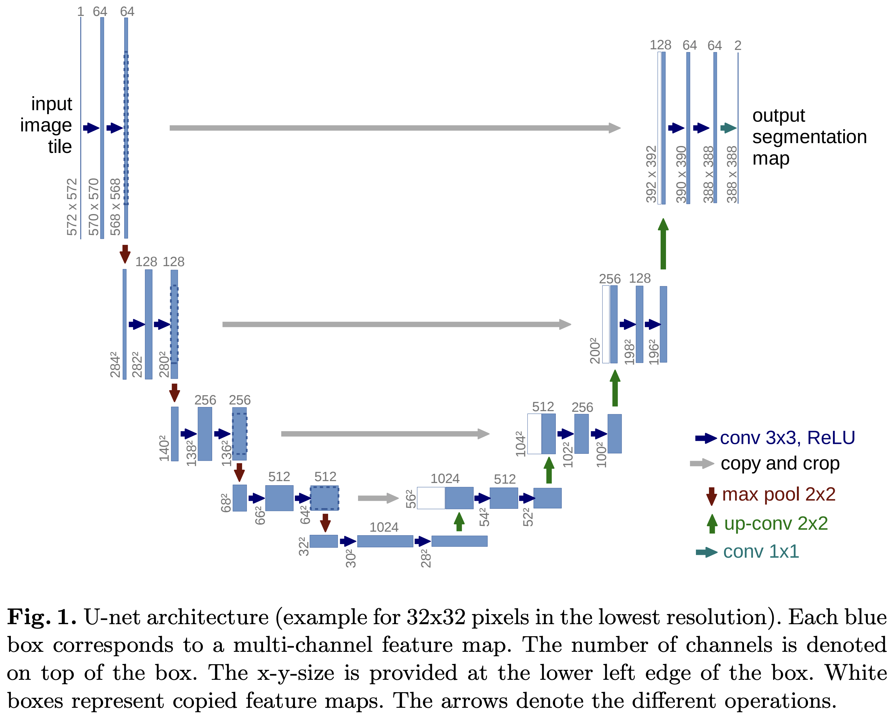
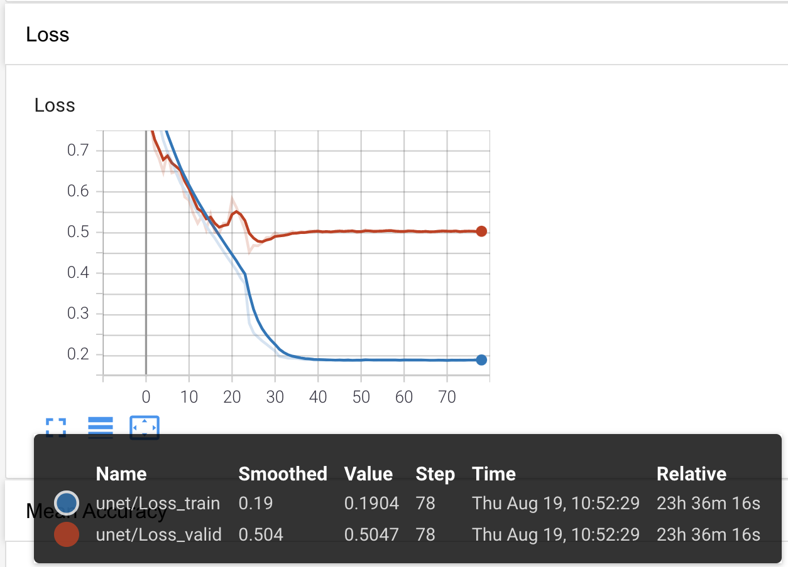
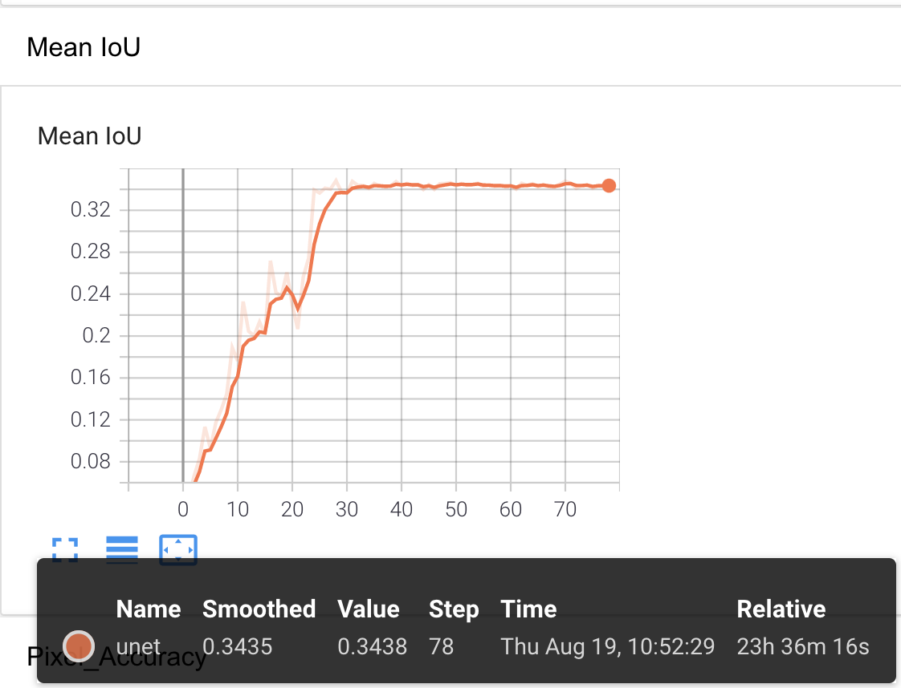
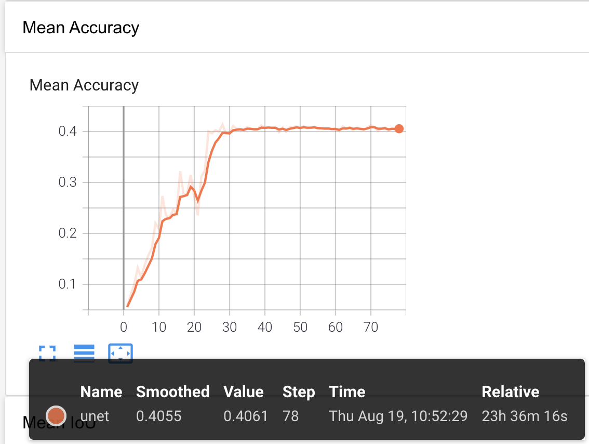
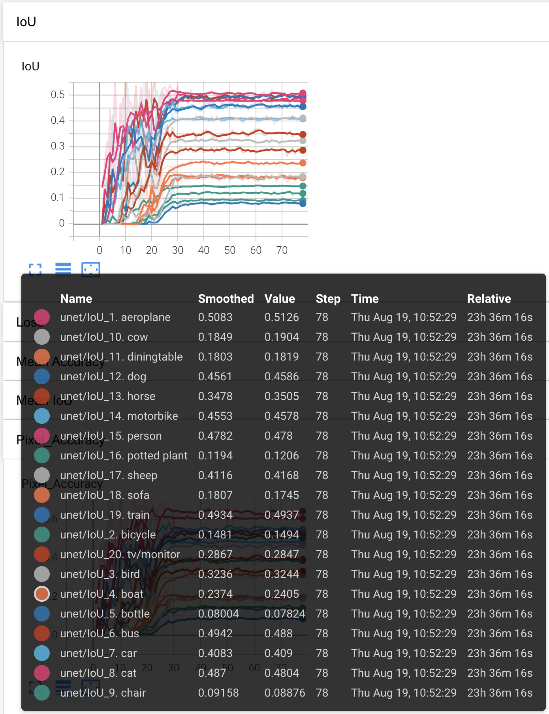
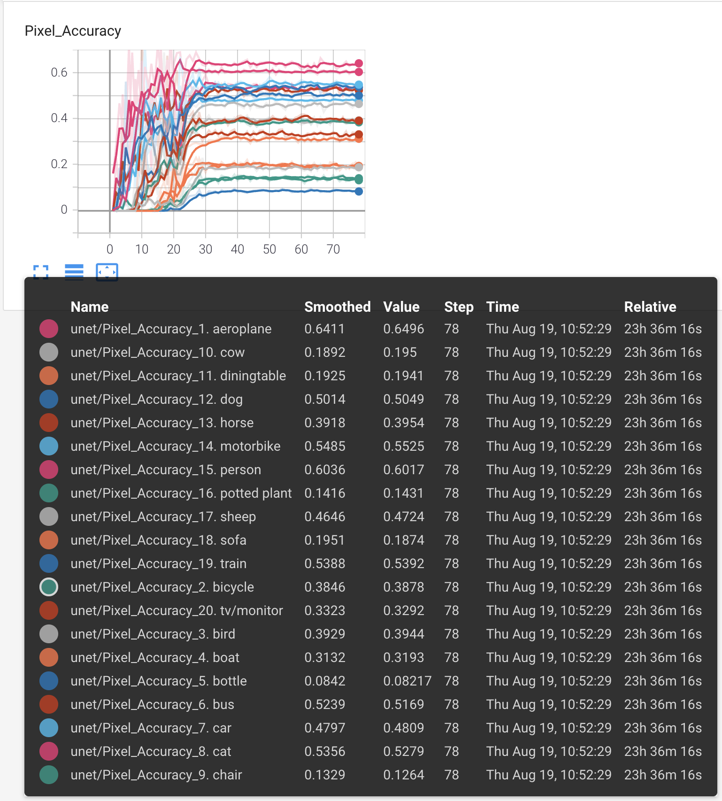

# U-Net: Convolutional Networks for Biomedical Image Segmentation

Pytorch로 [U-Net](https://arxiv.org/abs/1505.04597)을 구현한 코드입니다.

[PASCAL VOC 2012](http://host.robots.ox.ac.uk/pascal/VOC/voc2012/)에 [SBD](http://home.bharathh.info/pubs/codes/SBD/download.html)로 augmentation한 데이터셋을 사용해 모델의 학습 및 검증을 수행하였습니다.

구현한 네트워크 구조는 다음과 같습니다.  
(논문과 달리 overlap-tile strategy 없이 입출력이 동일한 size로 출력되도록 하였고, Batch Normalization을 사용하였습니다.)



## Environments

- Google Colab Pro
- Python 3.7.11

## Requirements

실험한 Colab 환경의 패키지들은 다음과 같이 설치할 수 있습니다.  
(Colab 환경에서 export한 패키지 목록이므로, 되도록이면 코랩 환경에서 진행하시기를 추천드립니다.)

```
pip install -r requirements.txt
```

## Results

학습한 결과는 다음과 같습니다. (약 50 epoch 이후부터 큰 성능의 개선이 없어서 78 epoch에서 학습 중단하였습니다.)

<div align="center">
  
</div>

<div align="center">
  
  
</div>

<div align="center">
  
  
</div>

## Quick Start

### Prepare Augmented Pascal VOC Datasets

1. Dataset을 위치시킬 디렉토리(여기서는 `data`)를 생성하고, [PASCAL VOC 2012 Dataset](http://host.robots.ox.ac.uk/pascal/VOC/voc2012/VOCtrainval_11-May-2012.tar)을 내려받아 압축을 풀고 다음과 같이 구성합니다.

```
u-net_convolutional_networks_for_biomedical_image_segmentation
├── data
│   ├── VOCdevkit
│   │   ├── VOC2012
│   │   │   ├── JPEGImages
│   │   │   ├── SegmentationClass
│   │   │   ├── ImageSets
│   │   │   │   ├── Segmentation
│   │   │   │       ├── train.txt
│   │   │   │       ├── val.txt
├── tools
│   ├── voc.py
```

2. [SBD Dataset](http://www.eecs.berkeley.edu/Research/Projects/CS/vision/grouping/semantic_contours/benchmark.tgz)을 내려받아 `data/VOCdevkit`에 압축을 풉니다.  
그리고 파일명을 `benchmark_RELEASE` -> `VOCaug`로 변경한 후 다음과 같이 구성합니다.

```
u-net_convolutional_networks_for_biomedical_image_segmentation
├── data
│   ├── VOCdevkit
│   │   ├── VOC2012
│   │   │   ├── JPEGImages
│   │   │   ├── SegmentationClass
│   │   │   ├── ImageSets
│   │   │   │   ├── Segmentation
│   │   │   │       ├── train.txt
│   │   │   │       ├── val.txt
│   │   ├── VOCaug
│   │   │   ├── dataset
│   │   │   │   ├── cls
├── tools
│   ├── voc.py
```

3. SBD Dataset으로 segmentation label mask 파일을 만들기 위해, [MMSegmentation repo](https://github.com/open-mmlab/mmsegmentation)를 참고하였습니다.  
  mmsegmentation repository를 clone하고, [Prepare datasets - PascalVOC](https://github.com/open-mmlab/mmsegmentation/blob/2acd563231cf83ff0b9edad9a92ffe2f0d3dd9bb/docs/dataset_prepare.md#pascal-voc)의 설명을 따라 `voc_aug.py` 스크립트를 실행하면, 다음과 같이 label mask 파일이 있는 `SegmentationClassAug` 디렉토리와 augmentation된 train data 파일들의 목록이 담긴 `trainaug.txt` 파일이 생성됩니다. (`mmcv` 패키지가 없다면 설치해주어야합니다.)

```shell
$ git clone https://github.com/open-mmlab/mmsegmentation
$ python mmsegmentation/tools/convert_datasets/voc_aug.py data/VOCdevkit data/VOCdevkit/VOCaug
```

```
u-net_convolutional_networks_for_biomedical_image_segmentation
├── mmsegmentation
│   ├── tools
│   │   ├── convert_datasets
│   │       ├── voc_aug.py
├── data
│   ├── VOCdevkit
│   │   ├── VOC2012
│   │   │   ├── JPEGImages
│   │   │   ├── SegmentationClass
│   │   │   ├── SegmentationClassAug
│   │   │   ├── ImageSets
│   │   │   │   ├── Segmentation
│   │   │   │       ├── train.txt
│   │   │   │       ├── val.txt
│   │   │   │       ├── trainaug.txt
│   │   ├── VOCaug
│   │   │   ├── dataset
│   │   │   │   ├── cls
├── tools
│   ├── voc.py
```

4. 마지막으로, 아래 `voc.py` 스크립트를 통해 `SegmentationClassAug`에 빠진 몇가지 label mask들과 validation set의 label mask를 모두 `SegmentationClassAug`에 만들어줍니다.  

```shell
$ python tools/voc.py
```

이로써, 모든 image 및 label mask 파일은 각각 `JPEGImages/`와 `SegmentationClassAug/`에 저장되고, 학습 및 검증 파일 목록은 각각 `trainaug.txt`와 `val.txt`에 기록되었습니다.

### Train Models

1. U-Net 모델은 다음과 같이 학습할 수 있습니다.

```shell
$ python main.py \
--data_dir data/ \
--save_dir experiments/ \
--tensorboard_dir runs/ \
--batch_size 8 \
--epochs 100
```

학습된 모델은 `experiments/`에 저장되고, tensorboard events는 `runs/`에 저장됩니다.

2. tensorboard를 통해 IoU, Mean IoU, Pixel Accuracy, Mean Accuracy의 curve를 확인할 수 있습니다.

```
tensorboard --logdir=runs/
```
